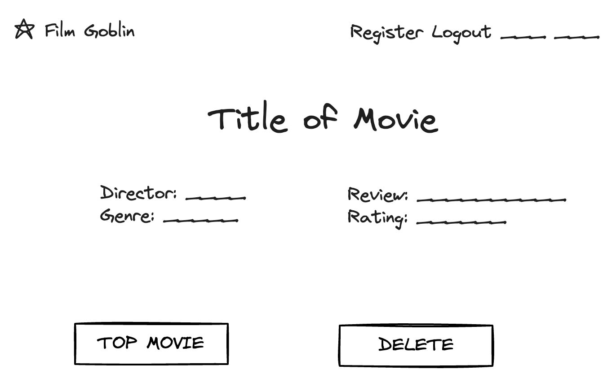

Introducing "Film Goblin" - an interactive movie tracker web application where users can rate movies, add reviews and look at the other users' favourite movies. This app is for:

## Setting Up
- Open with docker container
-  Open terminal
-  `Run: npm install`
-  `Run: npm run server`
-  Open browser url
-  Type: http://localhost:3000/
 
## Core Functionality

### Register An Account and Login

### Adding a movie you've watched to your account

Located at the top right - Add Movie

### Locating all the movies you've seen after adding them 

Locatedd at the top right - Movies

### Adding a top movie

Located at the right after creating a movie 'Add Review'

Ur top 10 rated movies will be listed in your top movies

### Searching your friends top movies

Type in your friends email 

### Adding movie to your watchlist 

Click on Watchlist in the top right and add a movie

# Application Design

## Requirements

- As a user, I want to see my friends profile so I can stalk their favourite movie.
- As a user, I want to track movies I've watched so I can add reviews and ratings to it.
- As a user, I want to show off my top movie to my friends.
- As a user, I would like to delete a review on a movie I've watched when it's no longer relevant.
- As a user, I want to have a profile photo so I can show off who I am as a person.
- As a user, I want to register for an account on Film Goblin so I can start using the app.
- As a user, I want to log in to  my account to access my movies.
- As a user, I want to log out of my account so I can do other things.
- As a user, I want to insert a genre of the movie I've watched so I can remember what type of movie I watched.
- As a user, I want to make reviews optional so I don't have to rate each one I've tracked.
- As a user, I want to be able to add movies to my watchlist, so that I can show my friends what Im gonna watch.
- As a user, I want to be able to delete all my movies on my watchlist, so that I have no irrelevant and outdated movies on it.
- As a user, I want to list the top 5 movies depending on my ratings.

## Entity Relationships
[](https://mermaid.live/edit#pako:eNqFVG1vmzAQ_iuWP60SjUwCacO3aNW2qnupMnWTKr54-JJYwjYypllG8t9nXgLEISpfMM89vrvn7rgSJ4oBjjDoB043mopYIvu85KDR4XB7q0r0Tb1xQBGKcUIloozF2CH9KNEKLGlnWVuaD6xlc64eLg0qLPbI0PNTD79RnWyp_uATcoNAUJ5e2kJrymie75RmvfWBGkCJBvtiS-PgwLgD_1quPn5ZrqyzyptWa57CM09eVl_PczQqqxU_tqGOsWwOTR0cRS31uiRREb5TAeOyGNeQGKVH6_TpaeySvZXvpcpynl8x1zGtNlNo6PQ5OtrmXvatRRydukYdobnRXG5QooQAOSh1ncn0BmlqrP3ckWgLNtQ2IrnLtp_EA_pNTbJNeW6G-fbgcF7fobbqqsC7EzgQV4-QnfR-gpwU6_TOCnkR9Q-kqhJ_brga2Oukn4-V18cbad9nkBpOP2ins0bdDm4q0GkgyEI0hn5Cu8o3Xi4C9co60uif0cfzLpotHHld3FhiDwvQdg8wu5VqlzE2W7DZ4WoFMVjTIjXVCjpaKi2M-rmXCY6MLsDDRcZs69pVhqM1TXOLZlS-KiVOJPuJoxL_xVHoTxZ35I7MQn8aLO49vMeRT2aTWUDm09An_jy0p6OH_9XXyeTeD-aLICDBnExJSBbH_8UDmOw)

## API Routes
| Request              | Action                           | Response              | Description                                                                         |
| -------------------- | -------------------------------- | --------------------- | ----------------------------------------------------------------------- |
| POST /users          | UserController::createUser       | 201 /login            | Create a new user and login                                                     |
| GET /users/:id       | UserController::getUser          | 200 UserProfile       | Retrieve user profile by id                                                        |
| PUT /users/:id       | UserController::updateUser       | 200 /users/:id       | Update user information                                               |
| POST /movies         | MovieController::addMovie        | 201 /movies/:id       | Add a new movie to user                                                      | 
| GET /movies/:id      | MovieController::getMovie        | 200 Movie             | Retrieve movie details by ID                                                        | 
| GET /movies          | MovieController::getAllMovies    | 200 MoviesView        | Show all movies                                                    |   
| PUT /movies/:id      | MovieController::updateMovie     | 200 /movies/:id             | Update movie information with genre                                                     |  
| DELETE /movies/:id   | MovieController::deleteMovie     | 204 /movies        | Delete a movie from user                                                      |   
| GET /register        | UserController::createUser       | 200 Registration      | Register form to create new user                                                      |
| GET /login           | UserController::LoginForm        | 200 Login             | Show log in form                                                      |
| POST /login          | UserController::Login            | 200 /movies           | Log in and show movies                                                    |
| GET /logout          | UserController::Logout           | 200 /                 | Logged out and cleared session                                                   |   
|POST/movies/:id/review| MovieController::addReview       | 200 /movies/:id        | Add a review on a movie you've watched                                                   |
| PUT /movies/:id/fave | MovieController::TopMovie        | 200 /movies             | Make a movie a top movie to add to profile                                                   |
|DEL /movies/:id/review| MovieController::deleteReview    | 200 /movies             | Delete a review from movie                                                     |
|GET /watchlist/:id        | WatchListController::getWatchlist| 200 WatchlistForm?    | Retrives user watchlist using user id 
|POST /watchlist/:id       | WatchListController::CreateWatchlist| 200 /watchlist/:id | Adds a movie to the user watchlist 
|DELETE /watchlist/:id | WatchListController::deleteWatchlist| 200 /watchlist/:id | Deletes all movies from the user watchlist 

## Wireframes

The login view is where the user inputs a correct email and password that they made in the register view to log in and see their movies.

This view shows the movie details. It displays the director, genre, review and rating of the movie that the user added to their tracker. You can make it your top movie to add it to your profile. You can also delete the movie off your list.
 
 
 This view shows the profile editor, used to edit your email, password and profile picture. In this page it displays your username and profile picture.

  
 This view is the homepage of Film goblin. It hooks the users into signing up to the website and gives a brief description on what the website is about.

